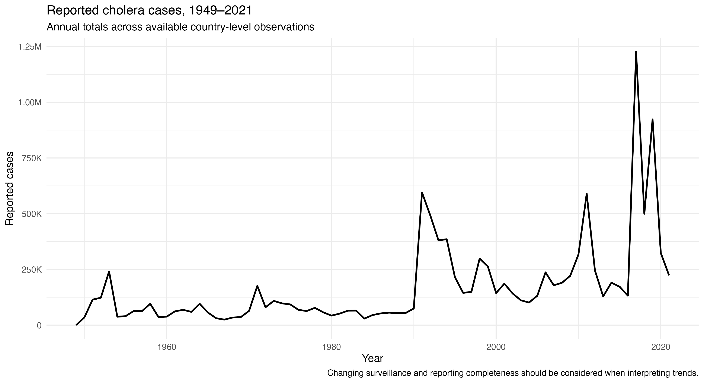
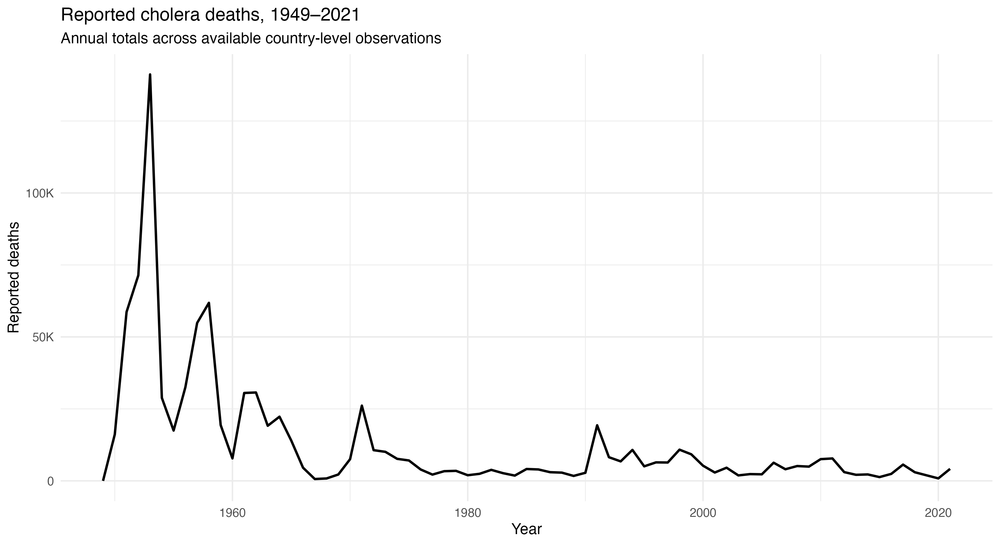
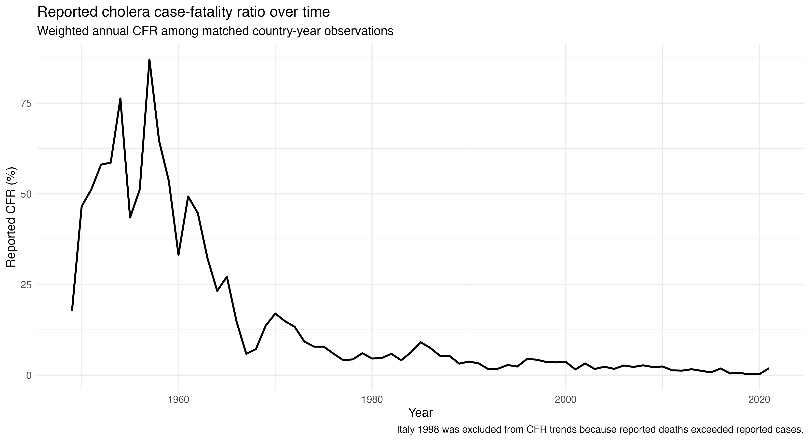
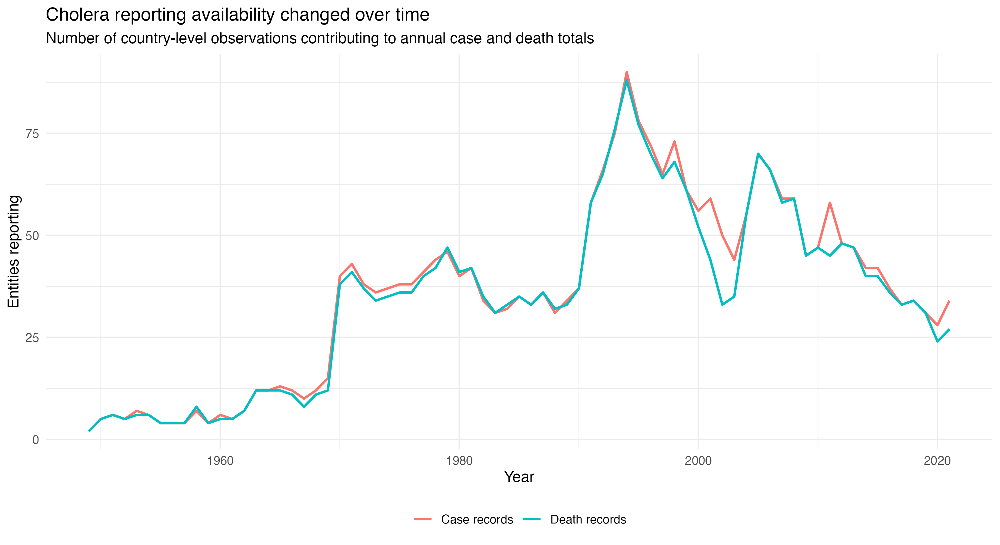
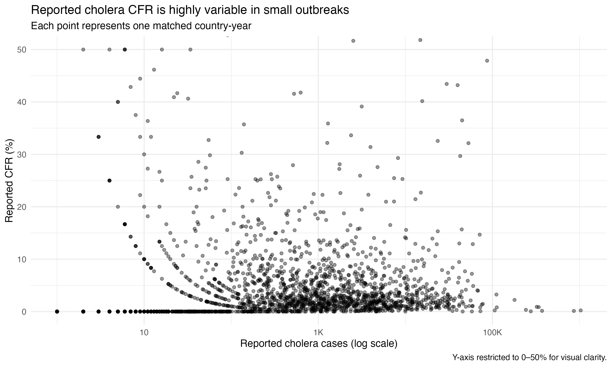
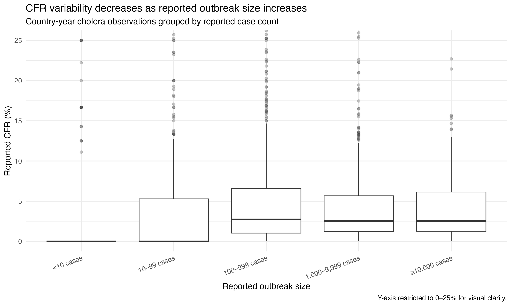
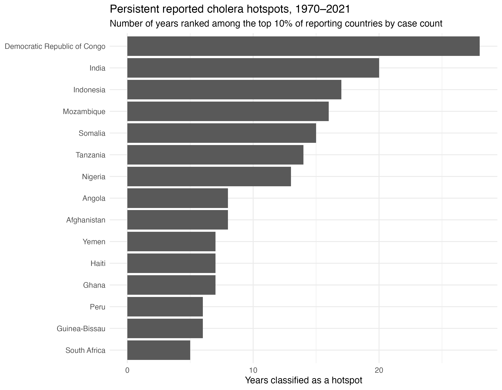
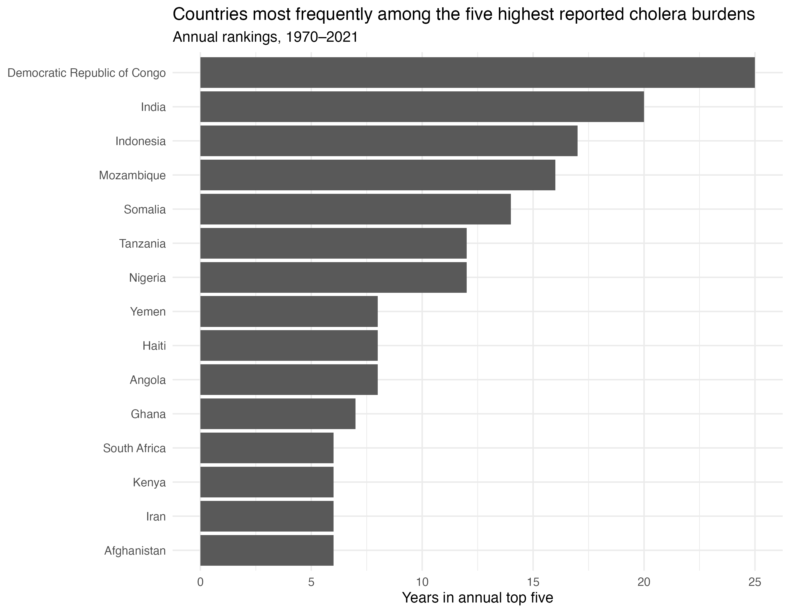
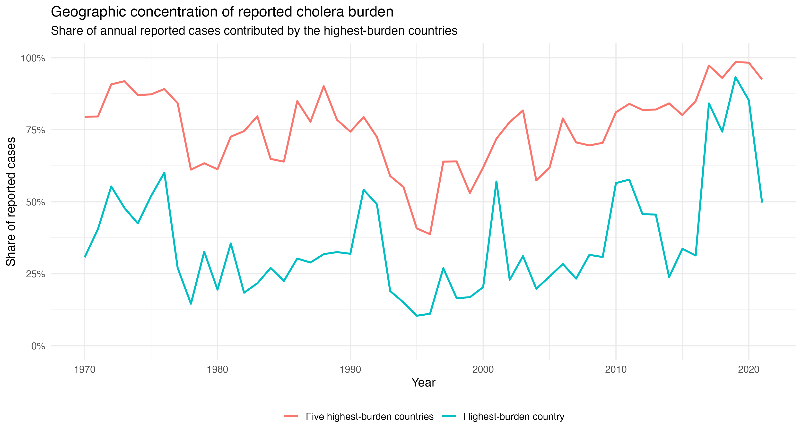

# Cholera Burden and Fatality

An epidemiological analysis of reported cholera cases, deaths, case-fatality ratios, outbreak size and geographic concentration.

## Research question

How has reported cholera burden and case-fatality changed over time, how sensitive are CFR estimates to outbreak size, and is reported cholera burden persistently concentrated in particular countries?

This project uses country-year surveillance data from 1949–2021 to explore:

- long-term trends in reported cholera cases and deaths
- reported cholera case-fatality ratios (CFR)
- data-quality issues arising when linking case and death surveillance
- the effect of small denominators on CFR estimates
- persistent high-burden countries
- geographic concentration of reported cholera burden.

---

## Key findings

### 1. Cholera burden varied substantially over time

After restricting the data to coded country-level observations, the analysis included:

- 2,626 country-year case records
- 2,519 country-year death records
- 2,498 matched country-years containing both case and death data

The highest annual reported case burden occurred in 2017, with approximately 1.23 million reported cases, followed by 2019 with approximately 923,000.



Reported cholera deaths showed a very different historical pattern, with the largest totals concentrated in the earlier years of the dataset.

The highest annual reported death burden was observed in 1953, when approximately 141,000 deaths were reported across the available country-level observations.



---

### 2. Reported CFR changed markedly over the study period

Annual weighted CFR:

\[
\text{CFR} =
\frac{\text{Total reported deaths}}
{\text{Total reported cases}}
\times 100
\]

Only matched country-years with more than zero reported cases were used.

Rather than averaging country-specific CFR estimates, deaths and cases were summed before calculating the annual CFR. This prevents very small outbreaks from receiving the same statistical weight as outbreaks involving thousands of cases.

Reported CFR values were extremely high in parts of the dataset. More recent annual weighted estimates were substantially lower, although variation remained.

| Year | Weighted reported CFR |
|---|---:|
| 2015 | 0.76% |
| 2016 | 1.83% |
| 2017 | 0.46% |
| 2018 | 0.60% |
| 2019 | 0.21% |
| 2020 | 0.27% |
| 2021 | 1.91% |



These trends should be interpreted alongside substantial changes in surveillance coverage and reporting over time.



---

## Data-quality assessment

Linking the case and death datasets identified:

- 128 case records without a corresponding death record
- 21 death records without a corresponding case record
- 49 matched observations with zero reported cases 
- one observation in which reported deaths exceeded reported cases

A suspicious observation was:

Italy, 1998

- Reported cases: 2
- Reported deaths: 9
- Apparent CFR: 450%

The record was retained in the processed dataset for transparency and flagged as a data-quality issue, but excluded from the primary CFR trend analysis.

No missing values were imputed.

---

## Outbreak size and denominator instability

This project examined whether country-year CFR estimates were affected by outbreak size.

Small denominators can produce highly unstable estimates: one reported death among one case produces a CFR of 100%, while the same single death among 1,000 reported cases produces a CFR of 0.1%.

The linked dataset demonstrated this.



### CFR by outbreak size

| Reported cases | Country-years | Median CFR |
|---|---:|---:|
| <10 | 530 | 0.00% |
| 10–99 | 432 | 0.00% |
| 100–999 | 634 | 2.74% |
| 1,000–9,999 | 622 | 2.54% |
| ≥10,000 | 230 | 2.54% |

Very small outbreaks produced large numbers of both 0% and extremely high CFR estimates.

Once outbreaks contained at least 100 reported cases, the central CFR estimate became substantially more stable.



### Sensitivity analysis

Minimum case thresholds were therefore applied to assess the effect of small denominators.

| Inclusion threshold | Country-years | Median CFR |
|---|---:|---:|
| All outbreaks | 2,448 | 1.51% |
| ≥10 cases | 1,918 | 2.34% |
| ≥100 cases | 1,486 | 2.66% |
| ≥1,000 cases | 852 | 2.54% |

Importantly, small outbreak size did not explain every extreme historical CFR.

Several high CFR estimates occurred in observations containing hundreds or thousands of reported cases. This suggests that denominator instability is only one potential explanation for extreme values; historical differences in surveillance, case ascertainment, death reporting and epidemic context must also be considered.

---

## Persistent cholera hotspots

Country-level observations from 1970–2021 were ranked within each year by reported case count to examine persistence.

A country was classified as an annual hotspot when it appeared among the top 10% of reporting countries for that year.

The most persistent hotspots:

| Country | Reporting years | Hotspot years | % of reporting years classified as hotspot |
|---|---:|---:|---:|
| Democratic Republic of Congo | 44 | 28 | 63.6% |
| India | 47 | 20 | 42.6% |
| Indonesia | 30 | 17 | 56.7% |
| Mozambique | 45 | 16 | 35.6% |
| Somalia | 30 | 15 | 50.0% |
| Tanzania | 43 | 14 | 32.6% |
| Nigeria | 50 | 13 | 26.0% |



The project also counted how frequently countries appeared among the five highest reported case burdens in a given year.

The Democratic Republic of Congo appeared in the annual top five 25 times and was followed by:

- India — 20 years
- Indonesia — 17 years
- Mozambique — 16 years
- Somalia — 14 years
- Nigeria — 12 years
- Tanzania — 12 years



These results suggest that reported cholera burden is not randomly distributed between countries: a subset of settings repeatedly appears among the highest reported burdens.

---

## Geographic concentration of reported burden

The project measured the proportion of annual reported cholera cases contributed by the following:

1. the single highest-burden country
2. the five highest-burden countries



The degree of concentration varied substantially between years.

| Year | Highest-burden country share | Top-five share |
|---|---:|---:|
| 1995 | 10.4% | 40.8% |
| 1996 | 11.1% | 38.7% |
| 2011 | 57.7% | 84.0% |
| 2017 | 84.2% | 97.3% |
| 2018 | 74.3% | 93.0% |
| 2019 | 93.3% | 98.5% |
| 2020 | 85.3% | 98.3% |
| 2021 | 49.7% | 92.5% |

In 2019, a single country accounted for more than 93% of all reported country-level cholera cases in the dataset, while the five highest-burden countries accounted for approximately 98.5%.

Annual global reported burden can become dominated by a very small number of major outbreaks.

---

## Analytical workflow

### `01_data_audit.R`

Audits the two source datasets for:

- structure
- temporal coverage
- missingness
- duplicate country-year records
- entities without country codes
- negative values
- extreme reported counts
- parsing problem

Only the cholera variable and identifiers required for the analysis are imported from the larger infectious-disease dataset.

---

### `02_data_cleaning_and_linkage.R`

Cleans and links country-level cholera case and death data.

Key steps include:

- standardising variable names
- removing aggregate observations
- linking datasets by country and year
- calculating reported CFR
- identifying unmatched observations
- flagging zero denominators
- flagging deaths exceeding case
- identifying small outbreaks where CFR estimates may be unstable

---

### `03_burden_and_cfr_trends.R`

Examines:

- annual reported cholera cases
- annual reported cholera deaths
- annual weighted CFR
- surveillance availability over time
- the highest-burden years

Case and death totals use all available cleaned records, while CFR calculations used only matched case/death observations.

---

### `04_cfr_and_outbreak_size.R`

Investigates denominator instability:

- CFR versus reported case count
- CFR distributions across outbreak-size categories
- sensitivity to minimum case-count thresholds
- extreme CFR observations
- CFR estimates after excluding very small outbreaks

---

### `05_hotspot_persistence.R`

Examines the geographic distribution of reported burden between 1970 and 2021.

- annual country rankings
- repeated top-decile appearances
- repeated annual top-five appearances
- persistent hotspot classification
- the proportion of annual burden concentrated in the highest-burden countries

---

## Repository structure

```text
cholera-burden-and-fatality/
│
├── data/
│   ├── raw/
│   │   ├── 1- the-number-of-cases-of-infectious-diseases.csv
│   │   └── 5- number-of-reported-cholera-deaths.csv
│   │
│   └── processed/
│       ├── cholera_cases.csv
│       ├── cholera_deaths.csv
│       └── cholera_linked.csv
│
├── plots/
│   ├── 01_reported_cholera_cases_over_time.png
│   ├── 02_reported_cholera_deaths_over_time.png
│   ├── 03_weighted_cholera_cfr_over_time.png
│   ├── 04_cholera_reporting_over_time.png
│   ├── 05_cfr_vs_outbreak_size.png
│   ├── 06_cfr_by_outbreak_size.png
│   ├── 07_persistent_cholera_hotspots.png
│   ├── 08_cholera_top_five_frequency.png
│   └── 09_cholera_burden_concentration.png
│
├── tables/
│   └── analysis outputs
│
├── 01_data_audit.R
├── 02_data_cleaning_and_linkage.R
├── 03_burden_and_cfr_trends.R
├── 04_cfr_and_outbreak_size.R
├── 05_hotspot_persistence.R
│
└── README.md
```

---

## Epidemiological considerations

### Reported cases are not equivalent to true incidence

The analysis uses surveillance reports rather than estimates of all infections occurring in the population.

Differences between countries or years may therefore reflect:

- surveillance intensity
- healthcare access
- diagnostic capacity
- outbreak detection
- reporting completeness
- differences in national surveillance systems

The results should consequently be interpreted as patterns in reported cholera burden, rather than complete measurements of underlying incidence.

---

### Reported CFR is not a direct measure of infection fatality

The CFR calculated here is:

\[
\frac{\text{reported deaths}}
{\text{reported cases}}
\]

Both the numerator and denominator are dependent on surveillance.

Under-ascertainment of milder cases could inflate apparent CFR, while incomplete death reporting could reduce it.

---

### Small denominators can distort CFR comparisons

Country-year CFR estimates based on only a handful of reported cases may fluctuate dramatically because of one additional reported death.

Therefore,

- outbreak size is always considered alongside CFR
- minimum case-count thresholds are explored in sensitivity analyses
- countries are not simply ranked by raw CFR without considering denominator size

---

### Reporting changed over time

The number of countries contributing cholera surveillance data varied substantially across the 1949–2021 period.

Therefore, early historical numbers are not directly comparable with later periods without considering changes in reporting coverage.

The hotspot analysis was restricted to 1970 onwards, when country-level reporting became substantially broader.

---

### Ecological analysis

All analyses are performed at country-year level.

Associations observed in these data cannot be assumed to apply to individuals and do not establish causal relationships.

---

## Tools

Analysis was conducted in R using packages:

```r
tidyverse
here
scales
```

Core techniques demonstrated in this repository include:

- data cleaning
- dataset linkage
- missing-data assessment
- surveillance quality assurance
- calculation of epidemiological ratios
- denominator sensitivity analysis
- non-parametric correlation
- longitudinal analysis
- ranking and hotspot classification
- burden concentration analysis
- reproducible data visualisation with `ggplot2`.

---

## Reproducibility

1. Clone the repository.
2. Open the project in R/RStudio.
3. Ensure the original source CSV files are stored in `data/raw/`.
4. Install the required R packages.
5. Run the scripts sequentially:

```r
source("01_data_audit.R")
source("02_data_cleaning_and_linkage.R")
source("03_burden_and_cfr_trends.R")
source("04_cfr_and_outbreak_size.R")
source("05_hotspot_persistence.R")
```

Processed datasets, tables and figures will be generated in their respective directories.

---

## Summary

This analysis demonstrates that reported cholera epidemiology is shaped not only by disease burden but also by the structure of surveillance data.

Across the dataset:

- reported cholera burden varied markedly over time
- historical reported CFR estimates were substantially higher than many recent estimates
- small outbreaks generated unstable country-year CFRs
- extreme historical CFRs were not restricted to small outbreaks
- a subset of countries repeatedly appeared among the highest reported cholera burdens
- annual reported cases could become highly concentrated in only a few countries

Together, these findings illustrate why surveillance data should be interpreted through both an epidemiological and a data-quality outlook. 